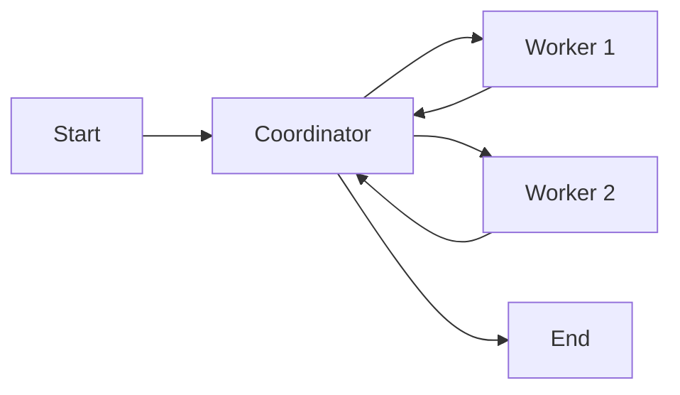

# Smart Factory MAS — Complete Learning Guide

## Part 1: Core Concepts (Theory)

### What is an LLM?

A **Large Language Model** (like llama3:8b) is an AI that understands and generates text. Think of it as a very smart text predictor — you give it a question, it generates an answer.

```
You: "What causes production delays?"
LLM: "Common causes include equipment failure, material shortages, and staffing issues..."
```

**Ollama** is a tool that lets you run LLMs **locally on your laptop** instead of using cloud APIs (like ChatGPT). This means:
- No internet needed during execution
- No API costs
- Full privacy

### What is a Multi-Agent System (MAS)?

Instead of one AI doing everything, you split the work across **multiple specialized AI agents**, each with a specific job:

```
❌ One agent doing everything (overwhelmed, unreliable)

✅ Multiple specialists:
   Agent 1: "I only read data"
   Agent 2: "I only analyze bottlenecks"  
   Agent 3: "I only create optimization plans"
   Coordinator: "I manage everyone"
```

**Why?** Same reason a hospital has specialists — a heart surgeon doesn't do brain surgery. Each agent is focused, so it produces better results.

### What is the Coordinator-Worker Pattern?

This is an architecture where one agent (the **Coordinator**) acts as the boss:

```
User Question
    ↓
Coordinator (boss)
    ├── "Get me the data" → Data Agent (worker)
    ├── "Analyze it"      → Analyst Agent (worker)  
    └── "Make a plan"     → Strategist Agent (worker)
    ↓
Coordinator combines all results → Final Answer
```

The Coordinator:
1. Receives the user's question
2. Breaks it into sub-tasks
3. Sends each sub-task to the right worker
4. Collects all results
5. Creates a final summary

### What is LangGraph?

**LangGraph** is a Python library that lets you build workflows as a **graph** (nodes + edges):

```
Nodes = Things that happen (agents doing work)
Edges = The flow between them (who goes next)
```



LangGraph manages:
- **State**: Shared data that all agents can read/write
- **Routing**: Which agent runs next
- **Message history**: The conversation between agents

### What are Tools?

Tools are **Python functions** that agents can use to interact with the real world:

```python
# Without tools: LLM can only generate text (might hallucinate)
LLM: "The production has 100 rows" ← might be made up!

# With tools: LLM calls a function that reads actual data
Tool: reads CSV file → returns real data
LLM: "The production has 100 rows" ← verified from real file!
```

Our 4 tools:
| Tool | What it does | Real-world analogy |
|------|-------------|-------------------|
| `read_production_data` | Reads CSV file | Opening a spreadsheet |
| `calculate_ptp_efficiency` | Math calculation | Using a calculator |
| `query_inventory_db` | Queries SQLite database | Checking warehouse inventory |
| `write_optimization_report` | Saves a file | Writing a document |

### What is LLM-as-a-Judge?

After the system generates a report, how do you know if it's good? You use **another LLM call** to evaluate it — like a teacher grading a student's paper.

The judge scores on 5 criteria (1-5):
1. **Factual Grounding** — Are the numbers real?
2. **Actionable Specificity** — Are recommendations useful?
3. **Hallucination Detection** — Did it make stuff up?
4. **Completeness** — Did it cover everything?
5. **Logical Coherence** — Does the reasoning make sense?

---

## Part 2: Project Structure (What Each File Does)

```
CTSE Assigment 2/
├── config.py              ← Settings (model name, file paths, etc.)
├── logger.py              ← Logging system (records everything that happens)
├── main.py                ← THE MAIN FILE — runs the entire workflow
├── generate_sample_data.py← Creates fake production data for testing
├── requirements.txt       ← Python packages needed
├── README.md              ← Documentation
├── Modelfile              ← Tells Ollama how to import the LLM
│
├── state/
│   └── global_state.py    ← Defines the shared data structure
│
├── prompts/
│   └── system_prompts.py  ← Instructions given to each agent
│
├── tools/
│   ├── production_tools.py← CSV reader + efficiency calculator
│   ├── inventory_tools.py ← Database query tool
│   └── report_tools.py   ← Report file writer
│
├── agents/
│   ├── coordinator.py     ← The boss agent
│   ├── data_retrieval.py  ← Worker: reads data
│   ├── bottleneck_analyst.py ← Worker: analyzes problems
│   └── optimization_strategist.py ← Worker: creates solutions
│
├── evaluation/
│   └── llm_judge.py       ← Quality evaluation script
│
├── data/                  ← Sample data files
├── outputs/               ← Generated reports
└── logs/                  ← Execution logs
```

---

## Part 3: How Each File Works (Code Walkthrough)

### 3.1 — `config.py` (Settings)

This is the simplest file. It stores all configuration in one place:

```python
OLLAMA_MODEL = "llama3:8b"           # Which AI model to use
OLLAMA_BASE_URL = "http://localhost:11434"  # Where Ollama is running
TEMPERATURE = 0.1                    # Low = deterministic (same input → same output)
MAX_COORDINATOR_ITERATIONS = 10      # Safety: stop after 10 loops
```

**Why centralize config?** If you want to change the model, you change ONE file, not 10 files.

### 3.2 — `state/global_state.py` (Shared Memory)

This defines the **shared data structure** that all agents read from and write to:

```python
class FactoryState(TypedDict):
    messages: ...              # Conversation history
    current_task: str          # What's happening now ("data_retrieval", etc.)
    task_queue: list[str]      # What's left to do
    completed_tasks: list[str] # What's done
    production_data: dict      # Data from CSV (filled by DataRetrievalAgent)
    bottleneck_findings: str   # Analysis (filled by BottleneckAnalyst)
    optimization_plan: str     # Plan (filled by OptimizationStrategist)
    final_report: str          # Summary (filled by Synthesizer)
    agent_trace: list[dict]    # Log of every action
```

**Key insight:** Each agent only WRITES to its own fields but can READ all fields. This is how they share information.

```
DataRetrievalAgent writes → production_data
BottleneckAnalyst reads production_data, writes → bottleneck_findings
OptimizationStrategist reads bottleneck_findings, writes → optimization_plan
```

### 3.3 — `tools/production_tools.py` (CSV Reader + Calculator)

**Tool 1: `read_production_data`**
```python
@tool  # This decorator tells LangChain "this is a tool an agent can use"
def read_production_data(file_path=None) -> str:
    # 1. Open the CSV file using pandas
    df = pd.read_csv(path)
    
    # 2. Build a summary (first 20 rows + statistics)
    summary = {
        "total_rows": len(df),
        "columns": list(df.columns),
        "sample_data": first_20_rows,
        "numeric_stats": {column: {mean, min, max, std}}
    }
    
    # 3. Return as JSON string (LLMs work with text)
    return json.dumps(summary)
```

**Tool 2: `calculate_ptp_efficiency`**
```python
@tool
def calculate_ptp_efficiency(planned, actual, target_threshold=85.0) -> str:
    # PTP = (actual / planned) × 100
    ptp_pct = (actual / planned) * 100
    
    # Classify the result
    if ptp_pct < 70:    classification = "CRITICAL"
    elif ptp_pct < 85:  classification = "WARNING"
    elif ptp_pct < 95:  classification = "ON_TARGET"
    else:               classification = "EXCEEDING"
    
    return json.dumps({"ptp_percentage": ptp_pct, "classification": classification})
```

**What is PTP?** Plan-to-Performance — if you planned 100 units but only made 60, your PTP is 60%. That's CRITICAL.

### 3.4 — `tools/inventory_tools.py` (Database Queries)

```python
@tool
def query_inventory_db(query_type, material_name="") -> str:
    # Connect to the local SQLite database
    conn = sqlite3.connect("data/inventory.db")
    
    if query_type == "low_stock":
        # Find materials where current stock < minimum needed
        cursor.execute("SELECT * FROM raw_materials WHERE stock_qty < min_threshold")
    elif query_type == "stock_level":
        # Find a specific material
        cursor.execute("SELECT * WHERE name LIKE ?", (material_name,))
    
    return json.dumps(results)
```

### 3.5 — `prompts/system_prompts.py` (Agent Instructions)

Each agent gets a **system prompt** — instructions that tell it who it is and what rules to follow:

```python
COORDINATOR_SYSTEM_PROMPT = """You are the Production Coordinator.
- Decompose the question into sub-tasks
- Available workers: "data_retrieval", "bottleneck_analysis", "optimization"
- ALWAYS start with data_retrieval first
- Do NOT invent data
"""

DATA_RETRIEVAL_SYSTEM_PROMPT = """You are the Data Retrieval Agent.
- Summarise the data clearly
- Do NOT make up any numbers
- Keep your summary under 300 words
"""
```

**Why are these important?** The LLM is general-purpose. Without clear instructions, it might try to do everything or hallucinate data. The prompt constrains it.

### 3.6 — `agents/coordinator.py` (The Boss)

The Coordinator has TWO jobs:

**Job 1: Decompose** (first call)
```python
def coordinator_node(state):
    if no tasks yet:
        # Ask LLM: "Break this question into sub-tasks"
        response = llm.invoke("Decompose this request into tasks")
        # LLM returns: ["data_retrieval", "bottleneck_analysis", "optimization"]
        task_queue = parse_response(response)
        next_task = task_queue.pop(0)  # Take first task
        return {"current_task": next_task, "task_queue": remaining}
```

**Job 2: Route** (subsequent calls)
```python
    if tasks remaining:
        next_task = task_queue.pop(0)  # Take next task
        return {"current_task": next_task}
    
    if all done:
        return {"current_task": "DONE"}  # → goes to synthesizer
```

**Routing function** — tells LangGraph which node to go to:
```python
def route_to_worker(state):
    routing_map = {
        "data_retrieval": "data_retrieval",        # → DataRetrievalAgent
        "bottleneck_analysis": "bottleneck_analyst", # → BottleneckAnalyst
        "optimization": "optimization_strategist",   # → OptimizationStrategist
        "DONE": "synthesizer",                       # → Final synthesis
    }
    return routing_map[state["current_task"]]
```

### 3.7 — `agents/data_retrieval.py` (Worker 1)

```python
def data_retrieval_node(state):
    # Step 1: Call the tool directly (get real data)
    tool_output = read_production_data.invoke({})
    production_data = json.loads(tool_output)
    
    # Step 2: Ask LLM to summarize the data
    response = llm.invoke(f"Summarise this data: {tool_output}")
    summary = response.content
    
    # Step 3: Return results to shared state
    return {
        "production_data": production_data,    # Raw data for other agents
        "completed_tasks": ["data_retrieval"],  # Mark as done
        "messages": [AIMessage(content=summary)] # Add to conversation
    }
```

### 3.8 — `agents/bottleneck_analyst.py` (Worker 2)

```python
def bottleneck_analyst_node(state):
    # Step 1: Read production data from state (written by Worker 1)
    production_data = state["production_data"]
    
    # Step 2: Calculate PTP for each production line
    for each line in production_data:
        result = calculate_ptp_efficiency.invoke({"planned": X, "actual": Y})
        # e.g., LINE-03: PTP=60.59% [CRITICAL]
    
    # Step 3: Check inventory for shortages
    inventory = query_inventory_db.invoke({"query_type": "low_stock"})
    # Returns 7 materials below minimum threshold
    
    # Step 4: Ask LLM to synthesize findings
    response = llm.invoke(f"Analyze these PTP results and inventory data...")
    
    return {"bottleneck_findings": response.content}
```

### 3.9 — `main.py` (The Orchestrator)

This is where the **LangGraph workflow** is built:

```python
def build_graph():
    graph = StateGraph(FactoryState)  # Create graph with our state type
    
    # Add nodes (each node is an agent function)
    graph.add_node("coordinator", coordinator_node)
    graph.add_node("data_retrieval", data_retrieval_node)
    graph.add_node("bottleneck_analyst", bottleneck_analyst_node)
    graph.add_node("optimization_strategist", optimization_strategist_node)
    graph.add_node("synthesizer", synthesizer_node)
    
    # Add edges (the flow)
    graph.add_edge(START, "coordinator")              # Start → Coordinator
    graph.add_conditional_edges("coordinator", route_to_worker)  # Coordinator → ???
    graph.add_edge("data_retrieval", "coordinator")   # Worker → back to Coordinator
    graph.add_edge("bottleneck_analyst", "coordinator")
    graph.add_edge("optimization_strategist", "coordinator")
    graph.add_edge("synthesizer", END)                # Synthesizer → Done
    
    return graph.compile()
```

**The flow:**
```
START → Coordinator → (decides: data_retrieval)
  → DataRetrievalAgent → Coordinator → (decides: bottleneck_analysis)
  → BottleneckAnalyst → Coordinator → (decides: optimization)
  → OptimizationStrategist → Coordinator → (decides: DONE)
  → Synthesizer → END
```

### 3.10 — `logger.py` (Observability)

Records everything for debugging:

```python
def log_agent_action(logger, agent_name, action, details):
    # Console: colored output
    # File: structured JSON trace
    trace = {
        "timestamp": "2026-04-20T20:09:08",
        "agent": "DataRetrievalAgent",
        "action": "data_retrieved",
        "details": {"rows_found": 100}
    }
```

### 3.11 — `generate_sample_data.py` (Test Data)

Creates realistic fake data:

- **CSV (100 rows):** Each row = one production record with date, line_id, planned_units, actual_units, defects, downtime
- **LINE-03 is intentionally bad** (55-72% of planned) to simulate a bottleneck
- **SQLite DB (15 materials):** 7 are intentionally below minimum stock to trigger alerts

### 3.12 — `evaluation/llm_judge.py` (Quality Check)

```python
def evaluate_report(report_content):
    # Give the report to the LLM with scoring instructions
    response = llm.invoke(
        "Score this report on 5 criteria (1-5). Return JSON."
    )
    # Parse: {"factual_grounding": 4, "actionable_specificity": 5, ...}
    return json.loads(response)
```

---

## Part 4: The Complete Flow (What Happens When You Run `python main.py`)

```
1. main.py starts
2. Builds the LangGraph workflow (nodes + edges)
3. Creates initial state with user query
4. Starts streaming through the graph:

   Step 1: COORDINATOR
   ├── Asks LLM: "Decompose this question"
   ├── LLM returns: ["data_retrieval", "bottleneck_analysis", "optimization"]
   └── Sets current_task = "data_retrieval"

   Step 2: DATA RETRIEVAL AGENT
   ├── Calls read_production_data tool → reads CSV → 100 rows
   ├── Asks LLM to summarize the data
   └── Stores production_data in state

   Step 3: COORDINATOR (again)
   └── Pops next task: "bottleneck_analysis"

   Step 4: BOTTLENECK ANALYST
   ├── Reads production_data from state
   ├── Calls calculate_ptp_efficiency for each line
   │   ├── LINE-01: 91.04% ON_TARGET
   │   ├── LINE-02: 92.24% ON_TARGET
   │   ├── LINE-03: 60.59% CRITICAL ← the bottleneck!
   │   ├── LINE-04: 92.29% ON_TARGET
   │   └── LINE-05: 83.92% WARNING
   ├── Calls query_inventory_db → 7 low-stock materials
   ├── Asks LLM to synthesize findings
   └── Stores bottleneck_findings in state

   Step 5: COORDINATOR (again)
   └── Pops next task: "optimization"

   Step 6: OPTIMIZATION STRATEGIST
   ├── Reads bottleneck_findings from state
   ├── Asks LLM to create optimization plan
   ├── Calls write_optimization_report tool → saves .md file
   └── Stores optimization_plan in state

   Step 7: COORDINATOR (again)
   └── No more tasks → current_task = "DONE"

   Step 8: SYNTHESIZER
   ├── Reads ALL results from state
   ├── Asks LLM to create executive summary
   └── Prints final report to console

5. Done! Report saved, logs captured, trace complete.
```

---

## Part 5: Key Terms Glossary

| Term | Meaning |
|------|---------|
| **LLM** | Large Language Model — AI that generates text |
| **Ollama** | Tool to run LLMs locally on your computer |
| **LangGraph** | Python library for building agent workflows as graphs |
| **LangChain** | Python library for building LLM applications (LangGraph is built on it) |
| **StateGraph** | LangGraph's workflow engine — nodes + edges + shared state |
| **Node** | A step in the workflow (an agent function) |
| **Edge** | Connection between nodes (who goes next) |
| **Conditional Edge** | Dynamic routing — decides which node based on state |
| **Tool** | A Python function an agent can call (read files, query DB, etc.) |
| **@tool decorator** | Marks a function as a LangChain tool |
| **TypedDict** | Python type hint for dictionaries with known keys |
| **PTP** | Plan-to-Performance — actual/planned × 100% |
| **System Prompt** | Instructions given to an LLM about its role and rules |
| **Hallucination** | When an LLM makes up false information |
| **GGUF** | File format for storing quantized LLM models |
| **bind_tools** | LangChain method to let LLM decide which tools to call (needs model support) |
| **Direct invocation** | Calling tools programmatically instead of letting LLM decide |
| **LLM-as-a-Judge** | Using an LLM to evaluate the quality of another LLM's output |
